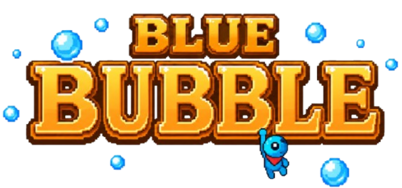
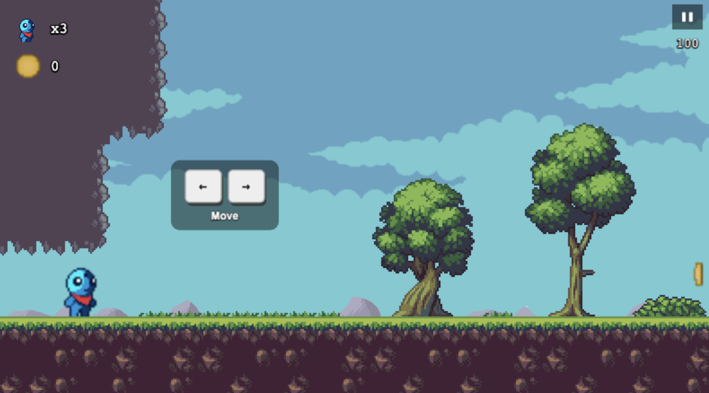
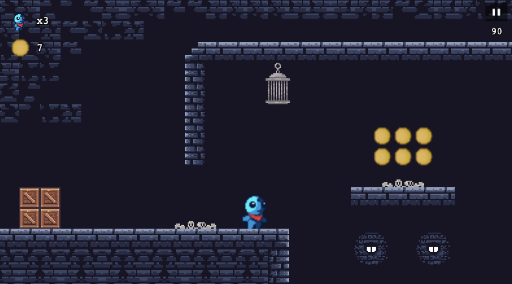

# Blue Bubble

Blue Bubble é um jogo de plataformas 2D em pixel art desenvolvido em Phaser 3 e JavaScript. O jogador percorre dois níveis, recolhe moedas, evita obstáculos e tenta chegar ao fim antes do tempo esgotar.

---

## Elementos do Grupo

* Miguel Rebouço — nº31429
* João Gomes — nº35780

---

## Tecnologias Utilizadas

* **Phaser:** 3.80.1 — incluído via **CDN**
* **Linguagem:** JavaScript (ES Modules)
* **Mapas:** Tiled Map Editor
* **Servidor local:** Live Server (VS Code) ou equivalente

---

## Descrição do Projeto

Este projeto consiste num jogo do tipo **platformer 2D**, desenvolvido com a framework Phaser 3.
O jogador controla uma personagem que percorre níveis com plataformas, obstáculos e inimigos, recolhendo moedas e superando desafios.

### Funcionalidades Implementadas

* 2 níveis jogáveis com design distinto
* Movimento do jogador (andar, correr, saltar, salto alto)
* Mecânica de escada (nível 2)
* Obstáculos: picos e paredes destrutíveis
* Recolha de moedas
* Timer de contagem decrescente
* Sistema de vidas
* Menu de pausa
* Efeitos sonoros e música de fundo
* Interface de utilizador (UI)
* Suporte multilingue (Português, Inglês, Espanhol)
* Ecrã de game over e seleção de nível

---

## Jogabilidade

* **Controlos:**

  * `←` / `→` — Mover
  * `↑` — Saltar (manter premido para saltar mais alto)
  * `Shift` — Correr
  * `E` — Dash (apenas disponível no nível 2)
  * `Enter` — Confirmar / Iniciar

* **Objetivo:**

  * Completar cada nível antes do tempo esgotar, recolhendo moedas e evitando obstáculos

* **Regras:**

  * O jogador começa com 3 vidas
  * Ao colidir com picos ou cair, perde uma vida
  * O jogo termina quando as vidas se esgotam ou o tempo chega a zero

### Capturas de Ecrã

**Nível 1**

**Nível 2**

---

## Como Abrir o Projeto

1. Clonar o repositório do GitHub
2. Abrir a pasta do projeto num editor de código (ex. **VS Code**)
3. Instalar a extensão **Live Server**
4. Abrir o ficheiro `index.html` e clicar em **"Open with Live Server"**
5. O jogo abre automaticamente no browser

> **Nota:** O projeto usa ES Modules e não pode ser aberto diretamente como ficheiro local (`file://`) — é necessário um servidor local.

---

## Assets Multimédia

Foram utilizados assets gratuitos, de estilo pixel art, obtidos em plataformas de assets livres de direitos (ex.: itch.io, OpenGameArt):

| Tipo | Formato | Resolução / Tamanho | Origem |
|---|---|---|---|
| Tilesets (plataformas, dungeon) | PNG | 512×320 px (por folha) | Gratuito (itch.io) |
| Spritesheet do jogador | PNG | Sprites de 32×32 px | Gratuito (itch.io) |
| Fundos (parallax scrolling) | PNG | 512×320 px | Gratuito (itch.io) |
| Efeitos sonoros | MP3 | — | Gratuito (Suno AI / suno.com) |
| Música de fundo | MP3 | 7,3 MB | Gratuito (Suno AI / suno.com) |
| Mapa Tiled | JSON | — | Criado no Tiled Map Editor |

Os tilesets foram integrados via Tiled e importados diretamente para o Phaser.
Os sons foram aplicados a eventos de jogo (salto, moeda, morte, música de nível).

### Justificação

Os assets foram escolhidos por serem gratuitos, de fácil integração com o Phaser e visualmente coerentes entre os dois níveis. O estilo pixel art enquadra-se no género platformer 2D e mantém consistência visual ao longo do jogo.

---

## Observações e Lacunas

* Possíveis melhorias futuras:

  * Adição de mais níveis
  * Sistema de pontuação com high-score guardado
  * Inimigos com inteligência artificial
  * Animações de transição entre níveis

---

## GitHub Pages

https://miguell-14.github.io/Platformer2D-Phaser/

---

## Notas Finais

O projeto encontra-se funcional ao nível das mecânicas principais, incluindo interface, som e suporte multilingue, podendo ainda ser expandido em termos de conteúdo e apresentação.
